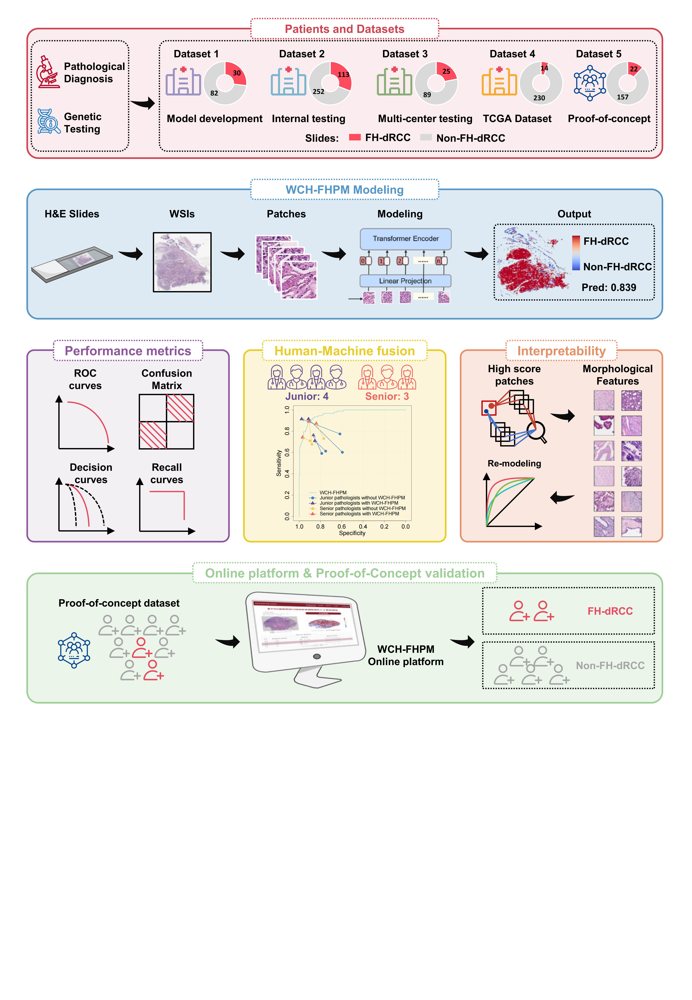

# WCH-FHPM: A Whole-Slide Image Model for Predicting FH-deficient Renal Cell Carcinoma

WCH-FHPM is a pathology artificial intelligence framework developed to predict fumarate hydratase-deficient renal cell carcinoma (FH-dRCC) from hematoxylin and eosin (H&E)-stained whole-slide images (WSIs). The workflow first identifies tumor-associated tissue regions and then estimates the probability of FH-dRCC at the slide level.

This repository provides the reference WSI-level inference workflow, released model checkpoints, comparator-model code, reference training-code templates, evaluation scripts, result summaries, and documentation for the online WCH-FHPM platform.

> **Important notice**
> WCH-FHPM is intended for research use only. It is not cleared for clinical diagnosis, treatment selection, or standalone medical decision-making. Model outputs should be interpreted together with histopathological review, immunohistochemistry, molecular testing, and clinical context.

## Repository structure

The current repository is organized as follows:

```text
WCH-FHPM/
├── Code/
│   ├── ABMIL/                         # ABMIL comparator model and related scripts
│   ├── Complete workflow of WCH-FHPM/ # Full WSI-level WCH-FHPM inference workflow
│   ├── TITAN/                         # TITAN+logistic-regression comparator model
│   ├── WCH_FHPM_training_code/        # Reference training-code templates
│   └── evaluate/                      # Code and data for reproducing analyses
│       ├── code/
│       └── data/
├── Data Sample/                       # Example data or download instructions
├── Online web platform/               # Web-platform documentation and screenshots
├── Result/                            # Main figures and result summary
│   ├── Figure 1.png
│   ├── Figure 2.png
│   ├── Figure 3.png
│   ├── Figure 4.png
│   ├── Figure 5.png
│   └── Main Result.md
├── LICENSE.md
├── README.md
└── workflow.png
```

Local editor-configuration files, such as `.vscode/`, may be present in the repository but are not required for running the code.

## Overview of the WCH-FHPM workflow

The full WCH-FHPM inference workflow includes the following steps:

1. **WSI loading and tissue filtering**: The H&E-stained WSI is tiled into image patches. Background and tissue-poor patches are removed.
2. **Tumor-associated patch detection**: A tumor detector identifies tumor-associated patches and excludes predicted normal-tissue-rich patches.
3. **FH-dRCC prediction**: The WCH-FHPM classifier estimates the FH-dRCC probability for each retained tumor-associated patch.
4. **Slide-level aggregation**: Slide-level probability is calculated by averaging FH-dRCC probabilities across tumor-associated patches.
5. **Output generation**: The workflow outputs patch-level predictions, slide-level predictions, model configuration files, and an FH-dRCC probability heatmap.



## Model weights

The released WCH-FHPM inference workflow requires two model checkpoints:

```text
WCH_TumorDetector_ViTBase512.pth
WCH_FHPM_ViTBase512.pth
```

The checkpoints are available from the repository release page:

```text
https://github.com/harryChenbear/WCH-FHPM/releases/tag/1.0
```

After downloading the checkpoints, place both files under:

```text
Code/Complete workflow of WCH-FHPM/models/
```

For example:

```bash
cd "Code/Complete workflow of WCH-FHPM"
mkdir -p models

# Place the two downloaded .pth files here:
# models/WCH_TumorDetector_ViTBase512.pth
# models/WCH_FHPM_ViTBase512.pth
```

## Quick start: full WCH-FHPM inference from one WSI

### 1. Install dependencies

```bash
cd "Code/Complete workflow of WCH-FHPM"
pip install -r requirements.txt
```

OpenSlide must also be installed on the system. The Python package `openslide-python` requires a working OpenSlide library installation.

### 2. Prepare model checkpoints

Download the following files from Release 1.0 and place them under `models/`:

```text
models/WCH_TumorDetector_ViTBase512.pth
models/WCH_FHPM_ViTBase512.pth
```

### 3. Run inference

```bash
bash run_example.sh /path/to/example_slide.svs ./wch_fhpm_result
```

Alternatively, run the Python script directly:

```bash
python run_wch_fhpm.py \
  --slide /path/to/example_slide.svs \
  --out_dir ./wch_fhpm_result \
  --device cuda \
  --tile_size 512 \
  --step_size 512 \
  --min_tissue_fraction 0.20 \
  --tumor_threshold 0.20 \
  --fh_cutoff 0.50 \
  --read_batch_size 128 \
  --batch_size 128
```

### 4. Expected outputs

```text
patch_predictions.csv        # Patch-level tumor-associated probability and FH-dRCC probability
slide_result.csv             # Slide-level FH-dRCC probability and binary prediction
FH_probability_heatmap.png   # Heatmap of FH-dRCC probability across retained patches
all_slide_results.csv        # Summary table for processed slides
run_config.json              # Runtime parameters
model_config_used.json       # Model configuration used for inference
```

## Input format notes

The released WCH-FHPM workflow uses OpenSlide-compatible WSI formats, such as:

```text
.svs
.ndpi
.tif
.tiff
```

KFB files are not natively supported by standard OpenSlide. If the input slides are in `.kfb` format, they should be converted to an OpenSlide-compatible format before running this workflow.

The released checkpoints were developed for 512 × 512 pixel patches from 40×-equivalent H&E WSIs. For the released checkpoints, `--tile_size` should remain 512. Changing tile size is not recommended unless the models are retrained or positional embeddings are properly adapted.

## Important parameters

| Parameter | Default | Description |
|---|---:|---|
| `--tile_size` | `512` | Patch size used by the released WCH-FHPM and tumor-detector checkpoints. This should remain 512. |
| `--step_size` | `512` | Step size for non-overlapping patch extraction. |
| `--min_tissue_fraction` | `0.20` | Minimum tissue fraction required for a patch to be retained. |
| `--tumor_threshold` | `0.20` | Tumor-associated probability cutoff used to retain tumor-associated patches. This is equivalent to excluding patches with predicted normal-tissue probability > 0.80. |
| `--fh_cutoff` | `0.50` | Slide-level probability cutoff for binary FH-dRCC prediction. |
| `--batch_size` | `128` | Batch size for model inference. |
| `--device` | `cuda` | Device for inference. Use `cpu` if GPU is unavailable. |

## Comparator models

This repository also includes code for two comparator models used in the study.

### ABMIL comparator

Path:

```text
Code/ABMIL/
```

This directory contains the attention-based multiple instance learning comparator model. It expects pre-extracted 1024-dimensional CLAM-style ResNet50 patch-level features for each WSI.

Typical use:

```bash
cd Code/ABMIL
pip install -r requirements.txt

python scripts/evaluate_external.py \
  --manifest /path/to/external_manifest.csv \
  --model models/WCH_ABMIL_FHPM_Dataset1_final.pt \
  --out_dir ./abmil_eval
```

For unlabeled feature files:

```bash
python scripts/predict_unlabeled.py \
  --feature_dir /path/to/pt_features \
  --model models/WCH_ABMIL_FHPM_Dataset1_final.pt \
  --out_csv abmil_predictions.csv
```

Sensitivity, specificity, positive predictive value, and negative predictive value are calculated using dichotomized predictions at a fixed cutoff of 0.5. AUROC is calculated from continuous slide-level probabilities unless otherwise specified.

### TITAN comparator

Path:

```text
Code/TITAN/
```

This directory contains the TITAN+logistic-regression comparator model. TITAN slide-level features should be extracted using the official TRIDENT/TITAN pipeline with 512 × 512 patches at 20× magnification.

Typical use:

```bash
cd Code/TITAN
pip install -r requirements.txt

export TRIDENT_DIR=/path/to/TRIDENT

bash scripts/extract_TITAN_features_with_TRIDENT.sh \
  /path/to/wsi_dir \
  /path/to/titan_job_dir \
  0

python scripts/predict_TITAN_LR_from_slide_features.py \
  --model models/TITAN_LR_Dataset1_model.joblib \
  --feature_dir /path/to/titan_job_dir/20x_512px_0px_overlap/slide_features_titan \
  --out_csv titan_predictions.csv
```

TITAN and CONCH v1.5 weights are not redistributed in this repository. Users should obtain and configure them according to the official MahmoodLab/TRIDENT and TITAN instructions.

## Reference training code

Path:

```text
Code/WCH_FHPM_training_code/
```

This directory provides reference training-code templates aligned with the reported model architecture and training settings. The training code is intended to document the model-design and optimization strategy. It is not intended to exactly reproduce the original historical training run without access to the original training WSIs, annotations, preprocessing state, and computing environment.

Main components include:

```text
train_tumor_detector.py
train_wch_fhpm.py
train_common.py
validate_manifest.py
run_train_tumor_detector.sh
run_train_wch_fhpm.sh
README_TRAINING.md
requirements_train.txt
examples/
```

## Evaluation scripts

Path:

```text
Code/evaluate/
```

This directory contains code and data used to reproduce performance analyses, figure panels, supplementary figures, and tables. Depending on the script, input files may include slide-level probabilities, binary predictions, subgroup labels, pathologist reads, or morphological annotations.

When using these scripts, please confirm that the script name and input file correspond to the final figure or table number in the manuscript version being reproduced.

## Online web platform

Documentation for the WCH-FHPM online platform is provided under:

```text
Online web platform/
```

The online platform supports WSI upload, FH-dRCC probability prediction, heatmap visualization, and result review. The web platform is intended for research reference and model demonstration. It should not be used as a standalone diagnostic tool.

Platform URL:

```text
https://wchrcc.ai4ss.com/
```

## Example data

Example data or download instructions are provided under:

```text
Data Sample/
```

If an example WSI is provided through an external link, download the file locally and run the full inference workflow as follows:

```bash
bash "Code/Complete workflow of WCH-FHPM/run_example.sh" \
  /path/to/example_slide.svs \
  ./example_output
```

For international accessibility, we recommend providing at least one OpenSlide-compatible example WSI through a stable public file host or repository release asset.

## Main results

Main result summaries and illustrative figures are provided under:

```text
Result/
```

This directory includes the main figures and `Main Result.md`.

## Citation

If you use this repository, model, or code, please cite the associated WCH-FHPM manuscript.

```text
[Manuscript citation to be added after publication]
```

## License

This repository is released under the MIT License. See `LICENSE.md` for details.

The model and code are provided for research use. They are not intended for clinical diagnosis, treatment selection, or direct patient-management decisions.

## Contact

For questions about the WCH-FHPM model, code, or online platform, please contact the corresponding authors listed in the associated manuscript.

